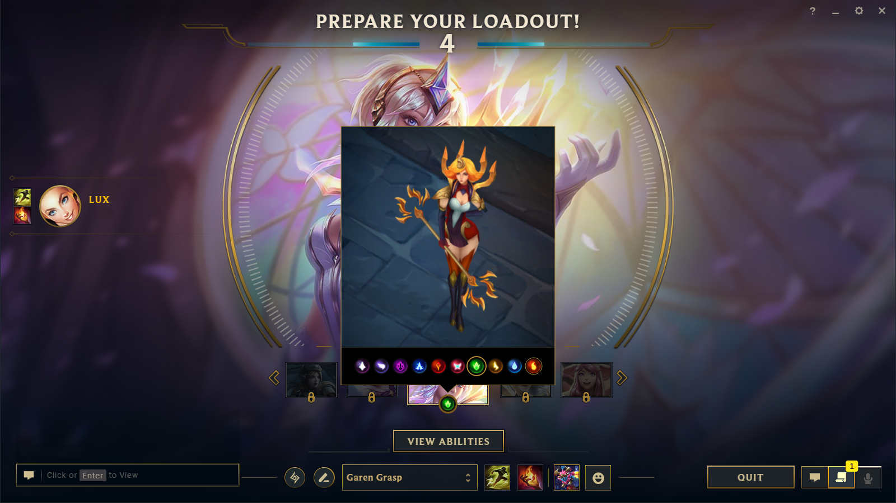
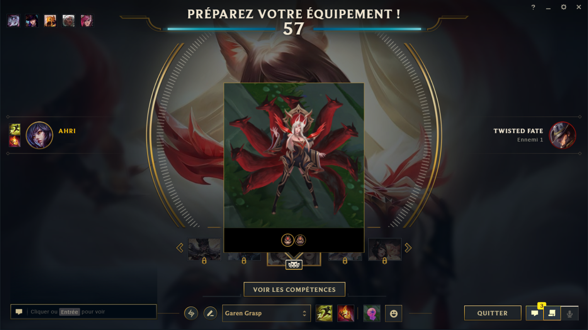

# 🔓 LeagueUnlocked - Seamless Automatic Skin Changer

  
  
  
  
  
  ### **✅ FULLY COMPATIBLE WITH LATEST VANGUARD UPDATE ✅**
  
  **LeagueUnlocked works seamlessly with Riot's anti-cheat system - no compatibility issues!** 

---

## ✨ What You Get

**LeagueUnlocked automatically gives you access to every skin in League of Legends - instantly, effortlessly, and safely.**

### **The Experience**

1. **Launch the app** - It runs silently in your system tray
2. **Play League normally** - No changes to your gameplay
3. **Hover over any skin** - In champion select, simply hover over skins
4. **Watch the magic happen** - Your chosen skin loads automatically when the game starts

**That's it!** No complex setup, no manual work - just pure, automated skin changing magic.

---

## 📸 **Features**

- **Every Skin Instantly** - Access to all skins for all champions
- **Chroma Selection** - Improved League's native UI to choose any chroma variant
- **Works in Any Language** - All languages supported (no exception)
- **Random Skin Feature** - You can activate random skin injection
- **Smart & Safe** - Never injects skins you already own and uses safe CS-LoL software for injection
- **Last Skin re-injection** - Automatically prepare to inject last injected skin for more enjoyable long sessions
- **Complex Skins Supported** - Special System to chose any complex skin (examples below)

---

## 🎮 **The Magic**

**Imagine this:** You're in champion select, hovering over skins. LeagueUnlocked detects what you're looking at and automatically prepares it for injection. When game starts, your chosen skin loads seamlessly - as if you actually owned it.

**No downloads, no waiting, no complexity.** Just pure, instant access to every skin in the game.

We are using our [own skins database](https://github.com/Alban1911/LeagueSkins), making us autonomous and able to quickly react to any problem you might encounter!

---

## 🎯 **Ready to Transform Your League Experience?**

**Download LeagueUnlocked today and transform your League of Legends experience!**

1. **Download** the [installer](https://github.com/Alban1911/LeagueUnlockedReleases/releases/latest)
2. **Run as Administrator** - One-time setup
3. **Enter your license key** - Secure activation -> To get a free key for the Beta: [Join our Discord server!](https://discord.com/invite/cDepnwVS8Z)
4. **Start playing** - Enjoy every skin instantly!

---

## ⚖️ **Legal Disclaimer**

**Important**

This project is not endorsed by Riot Games and does not represent the views or opinions of Riot Games or any of its affiliates. Riot Games and all related properties are trademarks or registered trademarks of Riot Games, Inc.

The use of custom skin tools may violate Riot Games' Terms of Service. Users proceed at their own risk.

Custom skins are allowed under Riot's terms of service and do not trigger detection as long as you are not discussing or advertising the use of the skins within the game.

---

**LeagueUnlocked** - _League, unlocked._
